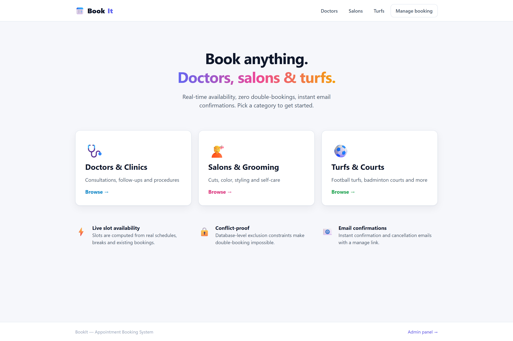
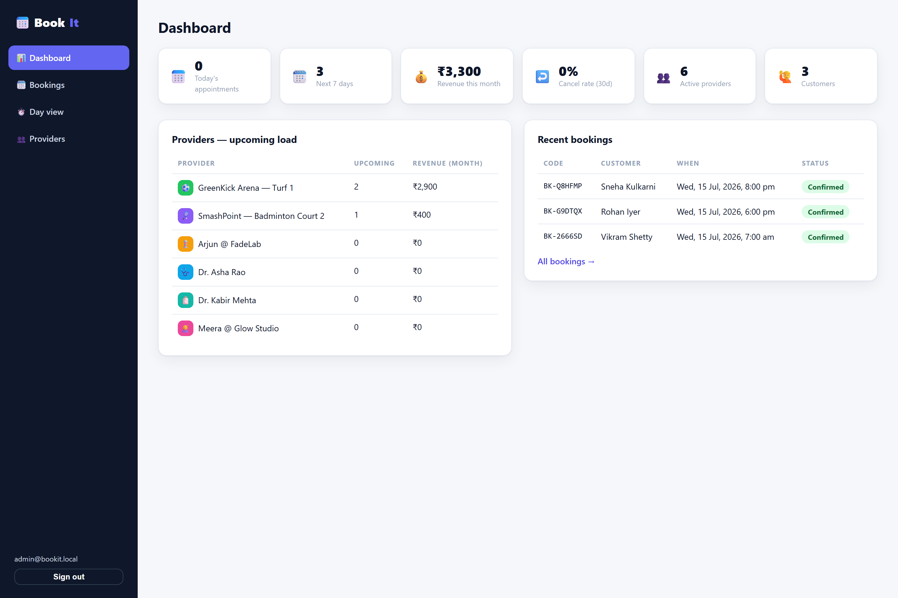
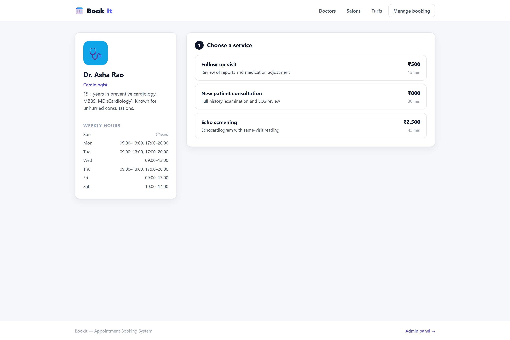
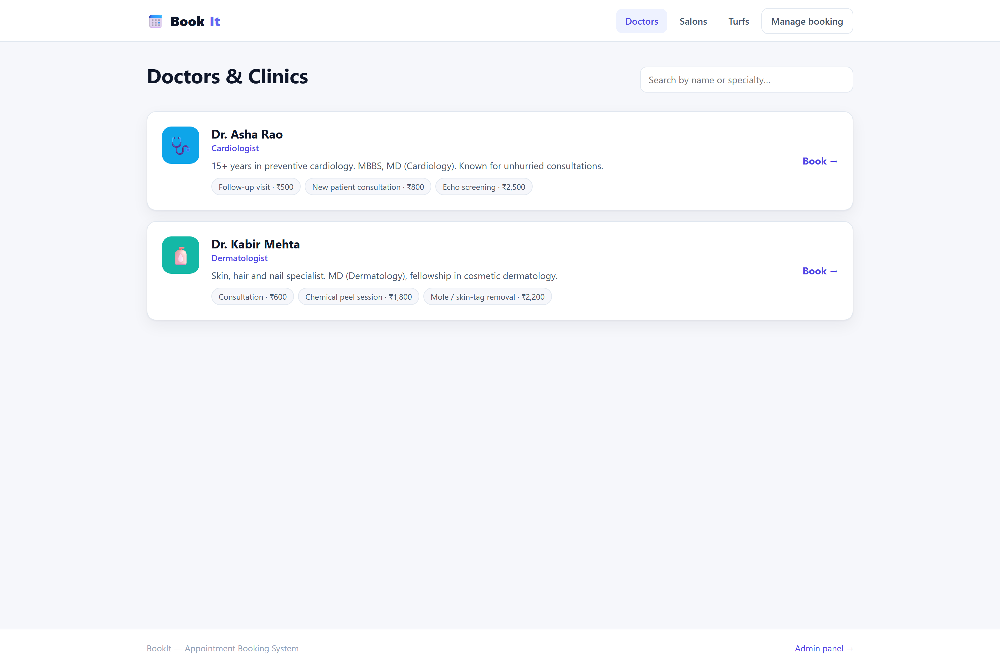
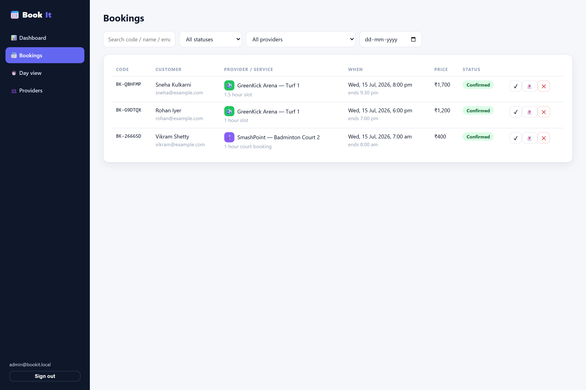
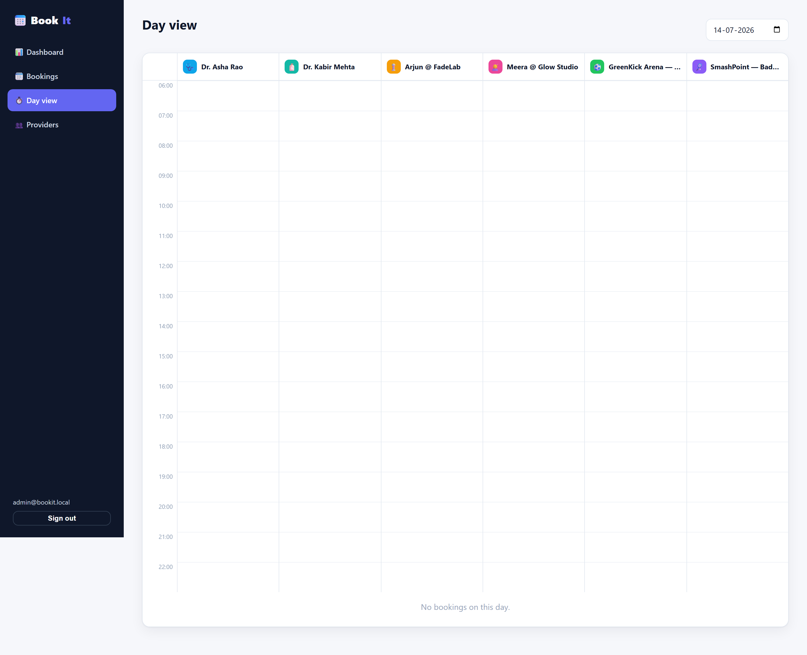

<div align="center">

# 📅 BookIt

### Multi-Vertical Appointment Booking System

*Book anything — doctors, salons & turfs — with **zero double-bookings**. A full-stack booking platform where the database itself makes overlapping appointments impossible.*

<br/>

[](https://react.dev/)
[](https://www.typescriptlang.org/)
[](https://vitejs.dev/)
[](https://expressjs.com/)
[](https://www.postgresql.org/)
[](https://zod.dev/)
[](https://jwt.io/)

[](LICENSE)


</div>

---

## 📖 Overview

**BookIt** is a full-stack, multi-vertical appointment booking platform for three
kinds of business — **doctors & clinics, salons & grooming, and sports turfs &
courts**. Customers browse providers, see **real-time bookable slots** computed
from each provider's live schedule, and book or cancel in a few clicks. Admins
manage providers, weekly schedules, services, breaks, time-off and every booking
from a dedicated dashboard.

The headline feature is **correctness under pressure**: two people can *never*
hold the same slot, even in a race between concurrent requests. BookIt guarantees
this with **three independent layers** — a per-provider advisory lock, in-transaction
slot re-validation, and a PostgreSQL GiST **exclusion constraint** that makes an
overlapping booking impossible at the database level.

> **The one-liner:** a React + Vite SPA talks to an Express + TypeScript API that
> validates every request with Zod, computes availability from live schedules, and
> leans on PostgreSQL exclusion constraints + advisory locks so double-booking is
> impossible by construction — not by hope.

<div align="center">

**🔑 Seeded admin login** &nbsp;·&nbsp; `admin@bookit.local` &nbsp;/&nbsp; `admin123`

</div>

---

## 📸 Screenshots

### Home — *pick a category and go*
> A hero and three category cards (doctors / salons / turfs), plus a feature strip: live slot availability, conflict-proof booking, and email confirmations.

<div align="center">
  
</div>

### Admin Dashboard — *the whole operation at a glance*
> Today's load, next-7-days pipeline, monthly revenue, 30-day cancel rate, active providers & customers, a per-provider upcoming-load table, and recent bookings.

<div align="center">
  
</div>

<table>
  <tr>
    <td width="50%">
      <b>🗓️ 3-Step Booking Flow</b><br/>
      <sub>Service → date & 14-day strip → time slots grouped Morning / Afternoon / Evening, computed live.</sub><br/><br/>
      
    </td>
    <td width="50%">
      <b>🔎 Browse Providers</b><br/>
      <sub>Searchable provider list per category, with services, pricing and hours.</sub><br/><br/>
      
    </td>
  </tr>
  <tr>
    <td width="50%">
      <b>📋 Admin Bookings</b><br/>
      <sub>Filter by status / provider / date, run complete / no-show / cancel actions, and see the audit history.</sub><br/><br/>
      
    </td>
    <td width="50%">
      <b>🕐 Day View</b><br/>
      <sub>A visual timeline of every booking across all providers for a chosen day.</sub><br/><br/>
      
    </td>
  </tr>
</table>

---

## ✨ Features

### 🧑‍💻 Customer side
- Browse providers by category (**doctor / salon / turf**) with search.
- Per-provider service catalog — duration, buffer time and price.
- **Live slot availability** computed from weekly schedules, breaks, time-off and existing bookings.
- Clean **3-step booking flow**: service → date & slot → details.
- Instant on-screen confirmation **+ email with a booking code**.
- Self-service **manage page**: look up by code + email, cancel with automatic slot release.

### 🛠️ Admin panel
- **Dashboard** — today's load, 7-day pipeline, monthly revenue, cancel rate, per-provider stats.
- **Bookings table** — status / provider / date / text filters; complete, no-show and cancel actions (cancel emails the customer).
- **Day view** — visual timeline of all bookings across providers.
- **Provider management** — details and booking policies (slot step, minimum lead time, booking horizon).
- **Weekly schedule editor** — multiple windows per day + recurring breaks.
- **Time-off** — one-off closures for vacations and maintenance.
- **Service CRUD** — duration, buffer and pricing.

### ⚙️ Platform
- **JWT-authenticated** admin API; **Zod** request validation everywhere.
- Email via **SMTP** (nodemailer); with no SMTP config, rendered emails land in `server/outbox/*.html` — so the flow works end-to-end with zero setup.
- **Booking audit trail** (`booking_events`): created, status changes, emails sent.

---

## 🎯 The flagship: zero double-booking

Double-booking is prevented with **three independent layers**, so even a race
between concurrent requests is safe:

| Layer | Mechanism | What it guarantees |
|:-----:|-----------|--------------------|
| **1** | `pg_advisory_xact_lock(42, provider_id)` | Serialises concurrent bookings **per provider**; different providers book fully in parallel. Released automatically at commit/rollback. |
| **2** | In-transaction slot re-validation | The requested start must still be a slot the availability engine would generate *right now* — a hand-crafted API call can't book a closed day. |
| **3** | Postgres GiST **exclusion constraint** | The last line of defence. Even raw SQL cannot persist an overlap. |

```sql
CONSTRAINT bookings_no_overlap EXCLUDE USING gist (
  provider_id WITH =,
  tstzrange(starts_at, ends_at) WITH &&
) WHERE (status IN ('confirmed', 'completed'))
```

The partial `WHERE` means cancelled / no-show bookings automatically free their
slot. A conflicting insert fails with SQLSTATE `23P01`, which the API maps to
**`409 Conflict`**, and the UI refreshes the slot grid.

> 📐 The full request-to-database walkthrough lives in **[`docs/ARCHITECTURE.md`](docs/ARCHITECTURE.md)**.

---

## 🛠️ Tech Stack

| Layer | Technology |
|-------|-----------|
| **Frontend** | React 18 · TypeScript 5 · Vite 6 · React Router 6 |
| **Backend** | Node.js · Express 4 · TypeScript 5 |
| **Database** | PostgreSQL 13+ (GiST exclusion constraints, advisory locks, range types) |
| **Validation** | Zod |
| **Auth** | JWT (jsonwebtoken) + bcryptjs |
| **Email** | Nodemailer (SMTP, with HTML outbox fallback) |
| **Tooling** | npm workspaces · tsx · concurrently |

---

## 🚀 Getting Started

### Prerequisites
- **Node.js** 18+
- **PostgreSQL** 13+ running locally (or a hosted connection string)

### Installation

```bash
# 1. Clone the repository
git clone https://github.com/bhanu87777/BookIt-Appointment-Booking-System.git
cd BookIt-Appointment-Booking-System

# 2. Install dependencies (npm workspaces installs client + server)
npm install

# 3. Configure the server environment
cp server/.env.example server/.env
#   → set DATABASE_URL to your local Postgres, and change JWT_SECRET

# 4. Create the database, apply the schema, and load demo data
npm run db:setup          # 6 providers, services, schedules, sample bookings

# 5. Run the API (:4000) and client (:5173) together
npm run dev
```

Open **http://localhost:5173** — the admin panel is at **http://localhost:5173/admin**
(`admin@bookit.local` / `admin123`).

---

## 📋 Usage

| Command | Description |
|---------|-------------|
| `npm run dev` | Start API (:4000) **and** client (:5173) together |
| `npm run build` | Production build of server + client |
| `npm run db:migrate` | Create the database (if absent) and apply the schema |
| `npm run db:seed` | Load demo providers, services, schedules & bookings |
| `npm run db:setup` | `db:migrate` + `db:seed` in one step |

**No mail provider? No problem.** Leave SMTP unset and every confirmation /
cancellation email is written to `server/outbox/*.html` — open them in a browser
to see exactly what the customer would receive.

---

## 📁 Project Structure

```
BookIt-Appointment-Booking-System/
├── assets/
│   └── screenshots/          # README imagery
├── docs/
│   ├── ARCHITECTURE.md       # request-to-database walkthrough
│   ├── BookIt_1_Features_Walkthrough.pdf
│   └── BookIt_2_Codebase_Guide.pdf
├── client/                   # React + Vite SPA
│   └── src/
│       ├── pages/            # home, browse, booking flow, confirmation, manage
│       ├── admin/            # dashboard, bookings, day view, provider editor
│       ├── components/       # shared layout / shell
│       ├── api.ts            # typed fetch wrapper (attaches admin JWT)
│       └── App.tsx           # route table
├── server/                   # Express + TypeScript API
│   └── src/
│       ├── db/
│       │   ├── schema.sql     # schema incl. exclusion constraints
│       │   ├── migrate.ts     # creates DB + applies schema (idempotent)
│       │   └── seed.ts        # demo data
│       ├── services/
│       │   ├── slots.ts       # availability engine
│       │   ├── booking.ts     # transactional booking (locks + validation)
│       │   └── email.ts       # confirmation / cancellation emails
│       ├── routes/            # public.ts + admin.ts
│       ├── middleware/        # auth (JWT) + central error handler
│       └── config.ts          # typed env config
├── server/.env.example
├── LICENSE
└── package.json              # npm workspaces root
```

---

## 🔌 API Quick Reference

| Method | Path | Description |
| --- | --- | --- |
| `GET` | `/api/providers?type=doctor` | Providers (with services) in a category |
| `GET` | `/api/providers/:id/slots?serviceId&date=YYYY-MM-DD` | Available slots for a date |
| `POST` | `/api/bookings` | Create a booking (**409** on conflict) |
| `GET` | `/api/bookings/lookup?code&email` | Look up a booking |
| `POST` | `/api/bookings/:code/cancel` | Customer cancellation |
| `POST` | `/api/auth/login` | Admin login → JWT |
| `GET` | `/api/admin/stats` | Dashboard metrics |
| `GET` / `PATCH` | `/api/admin/bookings…` | List / change booking status |
| `PUT` | `/api/admin/providers/:id/schedule` | Replace weekly schedule + breaks |
| `POST` / `DELETE` | `/api/admin/providers/:id/time-off` · `/api/admin/time-off/:id` | Manage time-off |

---

## 🔭 Future Improvements

- [ ] **Customer accounts** — booking history and saved details behind login
- [ ] **Online payments** — deposits / prepay via Stripe with refund-on-cancel
- [ ] **SMS & calendar** — reminders + `.ics` / Google Calendar invites
- [ ] **Recurring appointments** — weekly / monthly repeat bookings
- [ ] **Provider self-service portal** — providers manage their own schedules
- [ ] **Waitlist & auto-fill** — notify the next customer when a slot frees up
- [ ] **Test suite** — unit tests for the slot engine + integration tests on the conflict layers

---

## 🤝 Contributing

Contributions, issues, and feature requests are welcome!

1. Fork the project
2. Create your feature branch (`git checkout -b feature/amazing-feature`)
3. Commit your changes (`git commit -m 'Add amazing feature'`)
4. Push to the branch (`git push origin feature/amazing-feature`)
5. Open a Pull Request

---

## 📄 License

Distributed under the **MIT License**. See [`LICENSE`](LICENSE) for details.

---

## 👤 Author

**Bhanu Prakash M**

[](https://github.com/bhanu87777)

> 💡 If BookIt helped or impressed you, consider giving the repo a ⭐ — it genuinely helps!

<div align="center">
<sub>Built with React, Express, and PostgreSQL — and a healthy fear of double-bookings.</sub>
</div>
